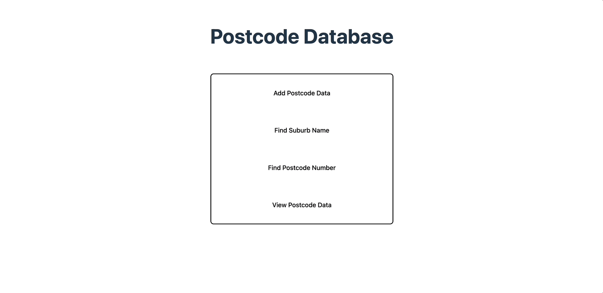

# postcode-api



## Requirements / Purpose

* Consolidate my Java back-end knowledge
* Consolidate Controller & Service layer testing in Java
* Ensure that information is securely handled

## MVP

* Mobile clients can retrieve suburb info by postcode and vice versa
* A secured API that allows clients to add new suburb and post code combinations
* A form of persistence (Database)
* Testing for Controller/Service layers

## Build Steps

- Back-end API port: 8080
- Front-end port: 5173
- Database:  port 3306/postcodeapi
- Table names: postcodeapi_data and suburb

## Design Goals / Approach
* Building an API which stores a suburb's name and postcode number.
* My first back-end that features a One-to-Many relationship.
* Logical back-end structure with basic front-end

## Features
* POST http://localhost:8080/postcode - Body must include and an Integer, "postcodeNumber" and an array, suburbs, with objects contained within for each suburb:
```java
"suburbs": [
    {
      "suburbName": "Hillarys"
    },
    {
      "suburbName": "Sorrento"
    }
  ]
```
API Calls:
* GET http://localhost:8080/postcode - returns all stored data pairings
* GET http://localhost:8080/postcode/number/{suburbName} - return post-code number from suburb name
* GET http://localhost:8080/postcode/name/{postcodeNumber} - return suburb name from post-code number
* Each item also includes a createdAt and updatedAt Column. Automatically pre-persisted.

Back-end 
* A custom validator has been constructed for the suburbs field in the DTO
* A smoke test, Service Layer (ServiceTest) test and a Controller layer test (TestingWebApplicationTest). All are closed with any data created, removed as the test is run.
* The postcode and suburbs have a One-to-Many relationship
* The suburbs field contains a Set<SuburbEntity>. The SuburbEntity has its own Entity and Repository and includes a postcode field.
* The id of the PostcodeEntity is correlated to the Postcode Number.

Front-end
* The front-end features extensive zod error handling to ensure that integers are passed into postcode and letters (or hyphens etc) into suburbs. The errors thrown are displayed in Toast Notifications.
* View all current postcodes in the database from the 'view' tab. You can also delete entries from the database through buttons on each List Item.
* Add a new postcode / suburbs data pair into from the 'add' tab. You are able to enter multiple suburbs by separating them by a comma.
* Return either the suburbs associated with a postcode or vice versa through their respective tabs 

## Known issues / Future Goals
* Might separate the SuburbEntity, custom validator and Repository into its own package - makes the API more readable.
* Might make a uniquely generated ID for the PostcodeEntity if it's not best practice to use the postcode itself as the ID.
* Make the Front-end styling a bit less bare

## Struggles
* The testing was very new to me. I used this website `https://spring.io/guides/gs/testing-web#initial` to determine which tests would be necessary and why
* I initially confused which relationships would be necessary. Changing the relationship from One-to-One to One-to-Many was new to me and required further research and understanding about how the API should be structured. Please look through the 'Change Log' below if you would like further details :)

## LOG

### 14th March 2024

* My first thought is that I'll be using hash maps to pair up the suburb names with the postcodes
* I'm iffy on Java testing so this will be a focus for me
* Going to initalise my repo and Java file. I don't think any unique packages (ones that I haven't used before) will be needed.
* Need to plan out the data table/entity

* I'm going to use a 1-1 relationship

#### ACHIEVED:
* Initalised the project file with: Spring Boot DevTools, Spring Web & MySQL Driver
* Initalised git repo and started this readme
* I've decided to use hashmaps to store my data

#### TOMORROW
* Start fleshing out my API
* Research into my implementation

### 15th March 2024

* added Entity and new dependencies (spring jpa and model mapper)

### 18th March 2024

* initialised Service, Controller, ModelMapping Config, Global Error Handler, Repo

* In my previous to-do assignmnent I have used ids to find items. However, I won't necessarily know the IDs when searching through the repo for data - this will change the way I get the data from the repo. 
* I am going to use different routes in how I structure returning the postcode and suburb respectively.

**TOMORROW**

- Finish fleshing out Controller - Separate functions for finding suburb and finding postcode
- Service Layer - first complete without model mapper and then finish off with model mapper (for practice)
- Implement Error Handling
- Implement Model Mapper
- Look into testing

### 19th March 2024
- I added functions to the Controller and Service layer to allow for POST and GET all functionality
- It went well, I had a few small hiccups but see below for what not to do next time

TO REMEMBER:
- table name is specified in the Entity whereas the name of the DB is specified in application.properties
- @NotBlank is only for Strings
- One of the Columns must be designated with @Id
- @PrePersist designates that the below function occurs automatically before the data is persisted into the DB
- ResponseEntity -> DTO -> Entity for incoming requests
- ResponseEntity <- DTO <- Entity for outgoing requests
- think through nomenclature from the beginning to avoid having to fix it up

**TOMORROW**
- getSuburbNameFromPostcodeNumber Controller function with unique API
- getPostcodeNumberFromSuburbName Controller funtion with unique API

### 20th March 2024
- I have added the separate API paths for retrieving suburbs from postcodes and vice versa

TO REMEBER:
- You can configure inside the repository layer what methods you want to manipulate/read from it e.g.
```java
public interface PostcodeRepository extends JpaRepository<PostcodeEntity, Integer> {

	Optional<PostcodeEntity> findBySuburbName(String suburbName);
	Optional<PostcodeEntity> findByPostcodeNumber(Integer postcodeNumber);
	
}

```
- I haven't needed to use this in my previous java assignment as I was using the default findByID which doesn't need to be pre-configured. I'm now realising I could've used this for retrieving the suburb name from postcodeNumber (since postcodeNumber is Id) but I'm still happy which my config.
- The usage of Optional means that the following Controller and Service layer methods will need to accept Optionals as well
- '::' or the method reference operator is used to refer to methods without invoking them directly. In combination with '.map' this results in the below function returning an Optional Ingeter instead of an Optional PostcodeEntity
```java
public Optional<Integer> getPostcodebySuburb(String suburb) {
	  Optional<PostcodeEntity> maybePostcodeEntity = repo.findBySuburbName(suburb);
      return maybePostcodeEntity.map(PostcodeEntity::getPostcodeNumber);
	}
```

TO-DO:
- testing
- exception handling & logging
- model mapping if needed

### 21st March 2024

https://spring.io/guides/gs/testing-web#initial

TO-REMEMBER:
- throws Excpetion just means a function can throw a checked exception
- "Checked exceptions are those that must be either caught or declared to be thrown by a method using the throws clause. Unchecked exceptions, on the other hand, do not need to be declared using throws and are typically subclasses of RuntimeException."

- testing is already initialised when making a Sprint Boot Application with SB Initalizr

- an example of a basic 'smoke' test ("A "smoke test" is a type of software testing that focuses on quickly checking whether the basic functionality of a system or component works correctly.")

```java
@SpringBootTest(webEnvironment = WebEnvironment.RANDOM_PORT) // prevents testing conflicts
public class SmokeTest {
	
	@LocalServerPort
	private int port;
	// injects server

	@Autowired
	private TestRestTemplate restTemplate;
	// automatic template
	
	@Test
	void greetingShouldReturnDefaultMessage() throws Exception {
		assertThat(this.restTemplate.getForObject("http://localhost:8080", String.class).contains("Hello, World"));
	}
}
```

**TOMORROW**
- finish testing module
- implement tests - controller and service layer (if module doesnt clear this up then do further research into it)
- implement exception handling using a glocal exception handler
- plan out employee assignmnent
- flesh out readmes and gifs for github profile
- github bio
- linkedin post graduation

### 22nd March 2024

- "Another useful approach is to not start the server at all but to test only the layer below that, where Spring handles the incoming HTTP request and hands it off to your controller. That way, almost all of the full stack is used, and your code will be called in exactly the same way as if it were processing a real HTTP request but without the cost of starting the server."
- > MockMvc < -
```java
import static org.hamcrest.Matchers.containsString;
import static org.springframework.test.web.servlet.request.MockMvcRequestBuilders.get;
import static org.springframework.test.web.servlet.result.MockMvcResultHandlers.print;
import static org.springframework.test.web.servlet.result.MockMvcResultMatchers.content;
import static org.springframework.test.web.servlet.result.MockMvcResultMatchers.status;

@SpringBootTest
@AutoConfigureMockMvc
class TestingWebApplicationTests {
	
	@Autowired
	private MockMvc mockMvc;

	@Test
	void shouldReturnDefaultMessage() throws Exception {
		
		this.mockMvc.perform(get("/")).andDo(print()).andExpect(status().isOk())
		.andExpect(content().string(containsString("Hello, World")));
	}
} 
```
- the imports for the functions on this.mockMvc didn't have options from Eclipse to add hence I'm leaving them there as a reference
- in this test the full Spring Application Context is started but without the server

- We can narrow it just the Web Layer (controller etc) by using @WebMvcTest
```java
import static org.hamcrest.Matchers.containsString;
import static org.mockito.Mockito.when;
import static org.springframework.test.web.servlet.request.MockMvcRequestBuilders.get;
import static org.springframework.test.web.servlet.result.MockMvcResultHandlers.print;
import static org.springframework.test.web.servlet.result.MockMvcResultMatchers.content;
import static org.springframework.test.web.servlet.result.MockMvcResultMatchers.status;

@WebMvcTest(GreetingController.class)
public class WebMockTest {
	
	@Autowired
	private MockMvc mockMvc;
	
	@MockBean
	private GreetingService service;
	
	@Test
	void greetingShouldReturnMessageFromService() throws Exception {
		
		when(service.greet()).thenReturn("Hello, Mock");
		// this changes the service using Moquito such that it will do this instead of the normal service
		
		
		this.mockMvc.perform(get("/greeting")).andDo(print()).andExpect(status().isOk())
		.andExpect(content().string(containsString("Hello, Mock")));
	}
}
```
- In this test will only test the Controller layer is instantiated
- mockito service has its output changed from default to match the test

### 23rd March 2024

Tests for post-code API
- Smoke test - tests server and Spring Application Context
- MockMvc test - tests Spring Application Context (including service layer)
- WebMvc test - tests Controller/Web layer (not including service layer)

### 26th March 2024
- added all 3 tests

ERROR HANDLING:
- don't need to throw an error if for example not finding any posts is a normal eventuality (for not founderrors)

### 27th March 2024
TO REMEMBER:
- in Java a hash map can have mpl key-value pairs
- 
```java
public class MyClass {
    private int errors; // Instance variable
    
    public void myMethod() {
        int errors = 0; // Local variable
        
        // Here, 'errors' refers to the local variable
        System.out.println(errors); // Prints the value of local variable
        
        // Here, 'this.errors' refers to the instance variable
        System.out.println(this.errors); // Prints the value of instance variable
    }
}
```
- 
```java
public class MyClass {
    private HashMap<String, ArrayList<String>> errors; // Instance variable
    
    public MyClass(HashMap<String, ArrayList<String>> errors) {
        this.errors = errors; // Assigning the value of local variable 'errors' to instance variable 'this.errors'
    }
}
```
- 
```java
private HashMap<String, ArrayList<String>>errors;
	
	public ValidationErrors() {
	// this is assigned to the instance variable hence its of type HashMap<String, ArrayList<String>>
		this.errors = new HashMap<>();
	}
```
- in the above example, the private declaration doesn't directly instantiate the HashMap - it forms an outline of what type of HashMap is required for the class
- the this.errors directly references this variable and instantiates it through 'new HashMap<>()'
- this ensures that the class has the correct Hashmap empty and ready to go
```java
package io.nology.postcodeapi.exceptions;

public class ServiceValidationException extends Exception {
	
	// this is needed for version control of serialised objects which this function
	// is due to its implementation of the Exception class
	private static final long serialVersionUID = 1L;
	
	private ValidationErrors errors;
	
	public ServiceValidationException(ValidationErrors errors) {
    // this instantiates the superclass Exception ensuring that necessary initialisation occurs
		super();
    // this class does not directly instantiate anything, it passes the errors as 
	// a reference to the ValidationErrors class which will then be instantiated
	// by the constructor class
		this.errors = errors;
	}
	
	public ValidationErrors getErrors() {
		return errors;
	}

}
```

## 28th March
- added in specific Service layer testing and refined logic
- learned that in tests where data is created, this data needs to be enclosed and removed within the same function
- other tests dependending on using this created data is not good as it can cause them to malfunction
  
<br>

- going to implement a front end this weekend, adding the planning diagrams to github now
- it's going to be simple and have resuable components from my last project
- the purpose of this is just to have a simple visualisation of my backend API
- my next employee register project will feature a more unique design
  
<br>

- furthermore, Calum made me aware of the existence of postcodes with multiple suburbs in it
- I will need to implement a one-to-many relationship of postcodes to suburbs (even if this is not the norm)
- Further research will need to happen before I implement this whether this necessitates a new package for the postcodes 

## 31st March
- outline of Front-end is done. Re-used Button and Modal Components from the To-do project. Minimal changes were required. This increased workflow efficiency significantly.
- Integrated in the Add Data Pair Logic
- Added a WebConfig package and class in the backend to allow for CORS

TOMORROW:
- add in context for toast notifications
- add in functionality for the 2 search query components and the view all component
- add in 1 to many relationship for postcodes in backend
- fix service testing in backend
- PROJECT COMPLETE

## 1st April
- added in delete and view functionality in the View All component
- styled it view overflow: scroll

TO-DO:
- toast notifs
- find suburb
- find postcode

- one to many relationship
- fix service testing 

## 2nd April
- combined the find suburb and find postcode components into 1 reusable component as well as the logic

TO-DO:
- one to many
- toast notifs
- service tests

## 3rd April

- Fixed back-end functionality allowing to persist Set<SuburbEntity> as suburbs in the body of the request
```js
{
  "postcodeNumber": 221903,
  "suburbs": [
    {
      "suburbName": "China"
    },
    {
      "suburbName": "India"
    }
  ]
}
```
- Almost done fixing up front-end to allow for this Typing change i.e. there can be many suburbs for one postcode

TO REMEMBER:
- Check mySQL for if the tables are correctly configured and persisted
- Even if not making a new package, you still need separate repositories for separate entities
- The parent entity needs to be persisted before persisting entities contained therein
- Order is important! When deleting Postcode Entity from DB, need to delete the internal associated SuburbEntities first

TMO:
- Fix return Suburbs functionality
- Fix typing in SearchComponent
- Add Context
- Flesh out ReadMe

## 6th April
- fixed Zod error handling when submitting a new data pair. It now shows a custom error message if numbers or letters are inputted.
- Fixed some styling on Toast Notifications.
- Added a new custom Validator for suburbs Set in SB. It now will not accept an input if the suburbName property of the Suburb Entities inside contain numerals.
- Fixed how the View Modal functionality handles when a Postcode pair is deleted. Added this into the toast notifications.
- fixed testing and overview to make sure code is production ready.

TMO:
- Finish fleshing out README with a demo.


